**软件说明书**

\> 使用说明

\> - 本文档作为\*\*中期检查\*\*与\*\*最终软件说明书\*\*的共用主文档。

\> - \*\*中期阶段\*\*：先完成标注为“中期必填”的内容；标注为“结项补全”的内容可暂留空。

\> - \*\*结项阶段\*\*：在中期版本基础上继续补全，整理后导出为最终doc/docx。

\> - 过程性图片请单独存放在\`assets/\`目录，正文中使用相对路径引用。

\> - 过程考核以Git中的md增量记录为主，最终排版稿以导出的doc/docx为准。

\---

基本信息

项目名称：**Personal-Finance-Management（个人理财管理系统）**

学 院：计算机学院

小组序号：42

成员姓名：饶轩，杨鑫，范国增，朱君昊，辛世豪

指导老师：兆远

当前版本：中期版

更新日期：2026年5月18日

\---

一、项目概述 【中期必填】

1\. 项目背景

本项目是计算机专业课程设计小组作业，面向在校学生与职场新人开发的轻量级个人理财管理系统。

旨在解决传统手工记账、Excel 管理效率低、数据易丢失、无预算管控、无可视化统计等现实痛点。

系统采用前后端分离 B/S 架构，用户通过浏览器即可完成在线记账、预算管理、收支分析，操作简单、轻量化、可直接部署使用，兼具学习价值与实用价值。

2\. 系统目标

实现用户注册、登录、登录状态保持的安全账户管理；

完成收支记录增删改查、按时间 / 分类筛选的核心记账功能；

支持月度预算设置、消费进度展示、超支预警；

提供收支汇总、支出占比饼图、收支趋势折线图等可视化分析；

搭建仪表盘首页，直观展示当月收支、结余、最近账单；

构建结构清晰、易维护、可扩展的前后端分离项目。

3\. 开发环境

前端环境

页面：HTML5、CSS3、原生 JavaScript 网络请求：Axios 图表：ECharts 浏览器：Chrome / Edge / Firefox

后端环境

框架：Spring Boot 3.x Web：Spring Web ORM：MyBatis-Plus 密码加密：BCrypt 工具：Lombok JDK：17+ Maven：3.6+

数据库

MySQL 5.7 / 8.0 库名：personal_finance 表：user、record、budget、category

二、需求分析 【中期必填】

1\. 功能需求

核心功能概述

该系统是面向个人用户的理财管理后端服务，核心围绕用户账户管理、收支记录管理、预算管理、数据统计分析四大模块展开，通过 RESTful API 为前端提供数据交互能力，支撑用户完成日常收支记账、预算管控、财务数据可视化等核心理财场景。

核心业务流程

用户账户管理流程

注册流程：用户提交用户名、密码、邮箱 → 系统校验参数（用户名非空、密码≥6 位）→ 密码通过 BCrypt 加密 → 保存用户信息（自动填充创建 / 更新时间）→ 返回注册成功结果（隐藏密码）。

登录流程：用户提交用户名、密码 → 系统校验账号密码（匹配加密后的密码）→ 返回登录成功结果（隐藏密码）。

用户信息查询：用户提交用户 ID → 系统查询用户信息 → 返回结果（隐藏密码）。

收支记录管理流程

添加记录：用户提交收支记录（含用户 ID、金额、分类、时间等）→ 系统校验（用户 ID 非空、金额＞0）→ 保存记录（自动填充创建 / 更新时间）→ 返回添加结果。

分页查询记录：用户提交用户 ID、分页参数（页码 / 页大小）、可选筛选条件（月份 / 分类）→ 系统分页查询符合条件的记录 → 返回分页结果。

修改记录：用户提交记录 ID、更新后的记录信息 → 系统更新记录（自动填充更新时间）→ 返回修改结果。

删除记录：用户提交记录 ID → 系统删除对应记录 → 返回删除结果。

预算管理流程

设置预算：用户提交预算信息（含用户 ID、分类、金额、月份等）→ 系统保存预算（自动填充创建 / 更新时间）→ 返回设置结果。

查询预算进度：用户提交用户 ID、月份 → 系统查询该用户当月各分类预算，并计算已支出金额 / 预算进度 → 返回预算及进度数据。

删除预算：用户提交预算 ID → 系统删除对应预算 → 返回删除结果。

数据统计分析流程

月度收支汇总：用户提交用户 ID、月份 → 系统统计该用户当月总收入、总支出、收支差额、各分类收支占比 → 返回汇总数据。

收支趋势分析：用户提交用户 ID、统计月份数（默认 6 个月）→ 系统统计近 N 个月收支趋势数据 → 返回趋势结果。

仪表盘聚合查询：用户提交用户 ID → 系统自动获取当前月份，聚合查询当月收支汇总近期 10 条账单、预算进度→返回一站式仪表盘数据。

2\. 非功能需求

\- 性能要求

响应时间：核心接口（登录、查询收支记录、仪表盘聚合）响应时间≤500ms；非核心接口（统计趋势、批量查询）响应时间≤1000ms。

并发能力：单服务器支持≥100 并发用户访问，分页查询接口支持单页 100 条数据快速加载。

数据处理：MyBatis-Plus 分页插件优化查询性能，避免全表扫描；时间字段自动填充无性能损耗。

\- 安全要求

密码安全：用户密码通过 BCrypt 加密存储，接口返回结果隐藏密码字段，禁止明文传输 / 存储。

参数校验：所有接口做参数合法性校验（如金额＞0、用户 ID 非空、密码长度≥6 位），防止非法参数注入。

异常处理：全局异常拦截，统一返回错误码和提示信息，避免暴露系统内部异常（如 SQL 错误、空指针）。

跨域安全：配置 CORS 跨域规则，开发阶段允许所有来源 / 方法 / 请求头，生产环境可限定指定前端域名。

数据安全：用户数据按 ID 隔离，查询 / 修改 / 删除操作仅能访问当前用户数据，防止越权访问。

\- 兼容性要求

技术栈兼容：

后端框架：Spring Boot 3.2.5，兼容 JDK 17；数据库：兼容 MySQL 8.0+（使用 mysql-connector-j 驱动）；依赖兼容：MyBatis-Plus 3.5.5 与 Spring Boot 3.x 适配，Lombok 1.18.30 兼容 JDK 17。

接口兼容：

接口返回格式统一（Result\<T\>封装，包含 code/message/data），前端可统一解析；HTTP 方法遵循 RESTful 规范（POST 创建、GET 查询、PUT 修改、DELETE 删除），便于前端对接。

 部署兼容：支持 Maven 打包部署，兼容主流 Java 应用服务器（如 Tomcat 10.x），可在 Windows/Linux 服务器运行。

三、系统设计 【中期必填】

1\. 系统架构

本系统采用分层架构设计（Layered Architecture），基于 Spring Boot + MyBatis-Plus 构建后端服务，遵循 “高内聚、低耦合” 的设计原则，整体分为四层，从下到上依次为：数据层、持久层、业务层、接口层（控制层，文档中未展示 Controller 代码但架构上包含）。

核心架构特点：

采用 Spring Boot 实现快速开发和自动配置，降低配置复杂度；基于 MyBatis-Plus 简化持久层开发，提供通用 CRUD 操作；服务层通过接口 + 实现类分离，便于扩展和测试；全层依赖注入（DI）通过 Spring 实现，使用 Lombok 简化代码；分层异常处理、参数校验，保障系统健壮性。

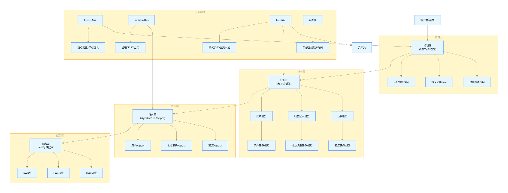

2\. 模块设计

| 模块名称     | 核心职责                                                 | 核心类 / 接口                                 | 依赖模块               |
|--------------|----------------------------------------------------------|-----------------------------------------------|------------------------|
| 用户模块     | 负责用户注册、登录、用户信息查询，是系统的基础模块       | UserService/UserServiceImpl、UserMapper       | 无（基础模块）         |
| 收支记录模块 | 核心业务模块，负责收支记录的增删改查、月度汇总、趋势统计 | RecordService/RecordServiceImpl、RecordMapper | 用户模块               |
| 预算管理模块 | 辅助业务模块，负责预算设置、预算进度查询、超预算校验     | BudgetService/BudgetServiceImpl、BudgetMapper | 用户模块、收支记录模块 |

3\. 数据库设计

\- E-R 图

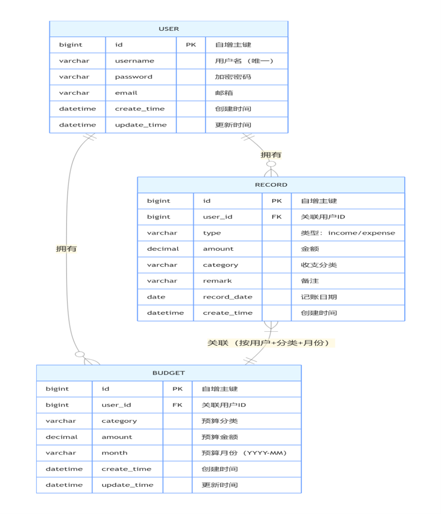

\- 主要数据表设计

用户表（user）

| 字段名      | 数据类型     | 约束               | 说明                |
|-------------|--------------|--------------------|---------------------|
| id          | bigint       | PK, AUTO_INCREMENT | 用户唯一标识        |
| username    | varchar(50)  | NOT NULL, UNIQUE   | 用户名（登录用）    |
| password    | varchar(100) | NOT NULL           | BCrypt 加密后的密码 |
| email       | varchar(100) | NULL               | 用户邮箱            |
| create_time | datetime     | NOT NULL           | 创建时间            |
| update_time | datetime     | NOT NULL           | 更新时间            |

收支记录表（record）

| 字段名      | 数据类型      | 约束               | 说明                                 |
|-------------|---------------|--------------------|--------------------------------------|
| id          | bigint        | PK, AUTO_INCREMENT | 记录唯一标识                         |
| user_id     | bigint        | NOT NULL, FK       | 关联用户 ID（数据隔离）              |
| type        | varchar(20)   | NOT NULL           | 类型：income（收入）/expense（支出） |
| amount      | decimal(10,2) | NOT NULL           | 金额（保留 2 位小数）                |
| category    | varchar(50)   | NOT NULL           | 收支分类（如餐饮、工资）             |
| remark      | varchar(200)  | NULL               | 备注说明                             |
| record_date | date          | NOT NULL           | 记账日期                             |
| create_time | datetime      | NOT NULL           | 创建时间                             |

预算表（budget）

| 字段名      | 数据类型      | 约束               | 说明                                   |
|-------------|---------------|--------------------|----------------------------------------|
| id          | bigint        | PK, AUTO_INCREMENT | 预算唯一标识                           |
| user_id     | bigint        | NOT NULL, FK       | 关联用户 ID（                          |
| category    | varchar(50)   | NOT NULL           | 预算分类（与 record 表 category 对应） |
| amount      | decimal(10,2) | NOT NULL           | 预算金额                               |
| month       | varchar(7)    | NOT NULL           | 预算月份                               |
| create_time | datetime      | NOT NULL           | 创建时间                               |
| update_time | datetime      | NOT NULL           | 更新时间                               |

数据表核心约束说明

数据隔离：所有业务表（record、budget）均通过user_id关联用户表，确保用户只能操作自己的数据；

唯一性约束：

user 表的username唯一，避免重复注册；budget 表中user_id + category + month组合唯一（业务层通过查询保证，可添加联合唯一索引）；数据类型：金额字段统一使用decimal(10,2)，避免浮点数精度丢失；

时间字段：create_time/update_time通过 MyBatis-Plus 自动填充，无需手动赋值；record 表的record_date为日期类型，便于按月份筛选统计；budget 表的month为字符串（YYYY-MM），简化月份维度的查询

四、系统实现 【中期部分填写；结项补全】

1\. 关键技术

核心框架与技术栈

基础开发技术：原生 HTML5 + CSS3 + JavaScript（ES6+），保障页面结构语义化、样式适配性及交互逻辑的原生性能，无框架依赖降低系统复杂度。 网络请求：Axios 库，封装请求拦截器（统一添加请求头、用户身份标识 userId）、响应拦截器（统一处理后端返回的状态码、异常信息），实现与后端 RESTful API 的稳定对接。 数据可视化：ECharts 5.x，实现支出分类饼图、近 6 个月收支趋势折线图、预算进度环形图的渲染，支持图表自适应、数据动态更新。 样式与交互优化：CSS Flex/Grid 布局实现页面响应式适配；原生 JS 实现表单校验（用户名重复、密码格式、收支金额合法性）、模态框交互、按月筛选记录等功能；本地存储（localStorage）临时缓存用户登录态，提升页面刷新后的体验。 跨域适配：配合后端 CORS 配置，前端请求时通过 Axios 配置 withCredentials: true，确保跨域请求中用户身份信息的正确传递。Spring Boot3.2.5后端核心框架，实现自动配置、IOC 容器、RESTful API 开发、内置 Tomcat 服务器MyBatis-Plus3.5.5ORM 框架，简化数据库 CRUD 操作、分页查询、条件构造器、自动填充时间字段MySQL8.0+关系型数据库，存储用户、收支记录、预算等核心业务数据Spring Security Crypto内置提供 BCrypt 密码加密算法，实现用户密码单向加密存储Lombok1.18.30简化 Java 代码，自动生成 getter/setter、构造器、日志等代码JDK17基础开发环境，兼容 Spring Boot 3.x 版本要求Maven3.6+项目构建与依赖管理工具

核心技术难点与解决方案

跨域请求失败 基于 Axios 配置跨域请求头，配合后端 CorsConfig 全局配置，确保请求携带用户标识且响应正常接收；统一处理跨域预检请求（OPTIONS）的兼容性问题。

表单校验逻辑复杂（注册 / 记账） 封装通用表单校验函数，对用户名（唯一性校验需调用后端接口）、密码（长度 / 格式）、收支金额（非负 / 数值格式）等字段做实时校验，校验失败时给出明确的提示文案。

图表数据动态更新与适配 封装 ECharts 初始化、数据更新方法，监听后端接口返回的统计数据变化，自动重新渲染图表；设置图表容器自适应宽高，适配不同屏幕尺寸。

登录态维持与权限控制 登录成功后将用户信息（userId、token）存入 localStorage，请求拦截器自动携带 userId 到后端；未登录状态下访问仪表盘 / 记账页时，自动跳转至登录页。

多条件筛选（收支记录按月 / 类型） 封装筛选参数处理函数，将筛选条件拼接为 URL 查询参数，调用后端分页接口；筛选条件变更时，重新请求数据并刷新页面列表，保留分页状态。

前后端跨域问题 通过CorsConfig配置全局跨域规则，允许所有来源、请求方法、请求头，支持 Cookie 携带

密码安全存储 使用 BCrypt 加密算法，注册时加密密码，登录时比对加密后的密码，永不存储明文

多用户数据隔离 所有业务接口强制传入userId，查询 / 修改操作通过userId作为核心筛选条件，确保数据隔离

分页查询性能优化 集成 MyBatis-Plus 分页插件（PaginationInnerInterceptor），基于 MySQL 物理分页，避免内存分页

统计类查询性能 自定义 SQL 语句（按月 / 分类聚合统计），利用 MySQL 的SUM/CASE/GROUP BY等函数，减少 Java 端数据处理

时间字段自动维护 实现MetaObjectHandler接口，自动填充createTime/updateTime字段，无需手动赋值

全局异常统一处理 通过@RestControllerAdvice实现全局异常拦截，统一返回规范的错误信息（状态码 + 提示语）

参数校验 分层校验：Controller 层基础参数校验（如金额 \> 0、用户 ID 非空），Service 层业务规则校验（如预算超支检查）

2\. 界面展示

登录页面

功能：输入用户名 / 密码，点击登录按钮触发校验，校验通过后跳转至仪表盘；用户名 / 密码错误时展示后端返回的错误提示；支持 “前往注册” 跳转。

界面说明：包含表单输入框、登录按钮、注册入口，样式适配 PC 端主流分辨率，提示文案居中展示。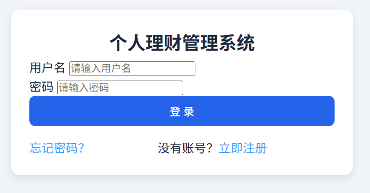

（2）注册页面

功能：输入用户名、密码、确认密码，实时校验密码格式，点击注册时校验用户名是否重复（调用后端接口），注册成功后跳转至登录页。

界面说明：表单含输入框、格式提示文案、注册按钮，密码输入框支持显隐切换，校验失败时红色提示文案展示。

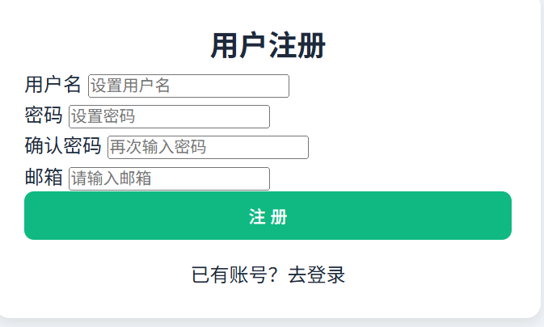

（3）仪表盘页面

功能：展示当月收入 / 支出 / 结余（数值）、最近 10 条收支记录（列表）、预算进度（环形图）；数据每 30 秒自动刷新一次，确保与后端同步。

界面说明：采用卡片式布局，数值模块突出展示，记录列表支持点击跳转至记账记录页，预算进度图实时显示使用比例.

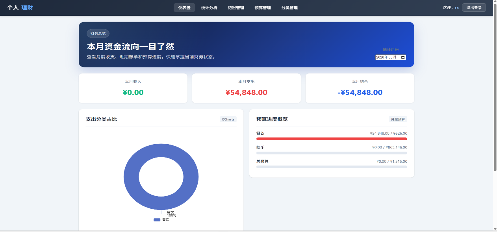

（4）记账记录页面

功能：支持 “添加 / 修改 / 删除” 收支记录（弹窗表单）、按月筛选记录、分页展示；操作后实时调用后端接口，成功后刷新列表。

界面说明：顶部筛选栏（月份下拉框）、新增按钮，列表展示记录类型 / 金额 / 时间 / 备注，操作列含编辑 / 删除按钮，分页控件在底部。

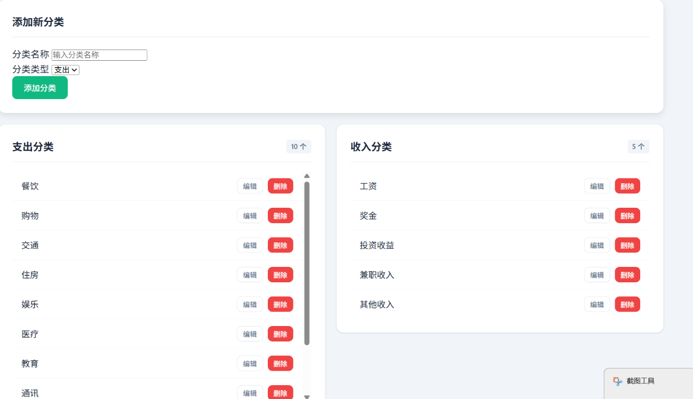

（5）预算管理页面

功能：输入月度预算金额并保存（调用后端接口），展示当前预算金额、已消费金额、使用比例，超支时红色字体提醒。

界面说明：预算设置输入框 + 保存按钮，金额统计模块，预算进度环形图，超支提醒文案醒目展示。

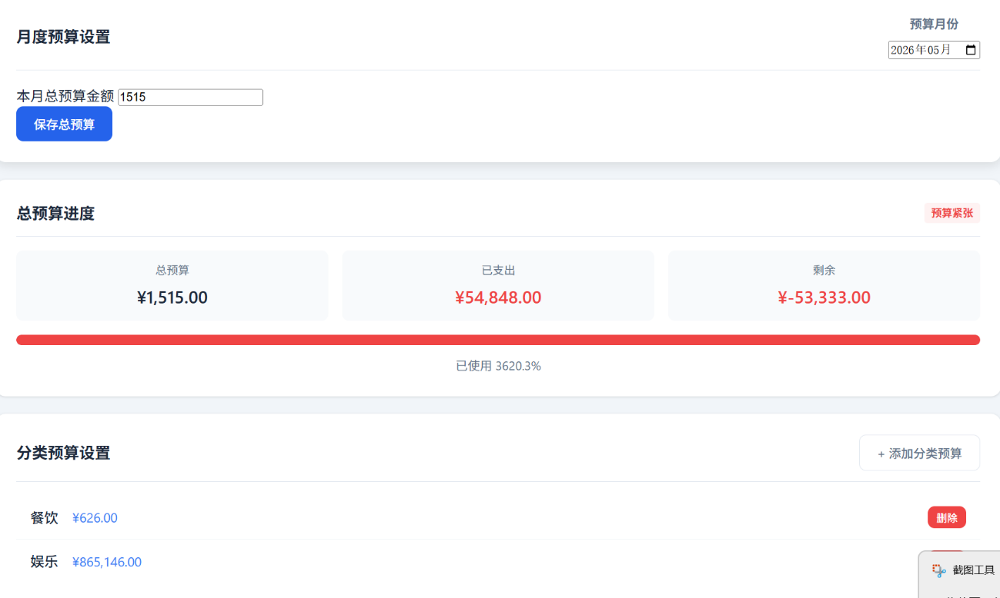

（6）数据统计页面

功能：展示支出分类饼图（按类别统计占比）、近 6 个月收支趋势折线图（收入 / 支出双轴）；支持点击图例切换展示项。

界面说明：双图表布局，饼图展示支出结构，折线图展示收支趋势，图表下方标注数据更新时间

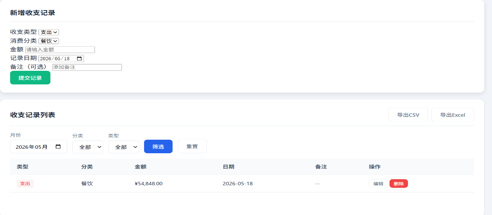

3\. 核心代码片段

数据库连接配置（application.yml）

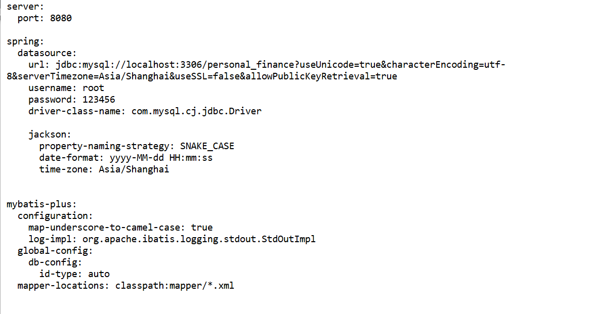

跨域配置（CorsConfig.java）

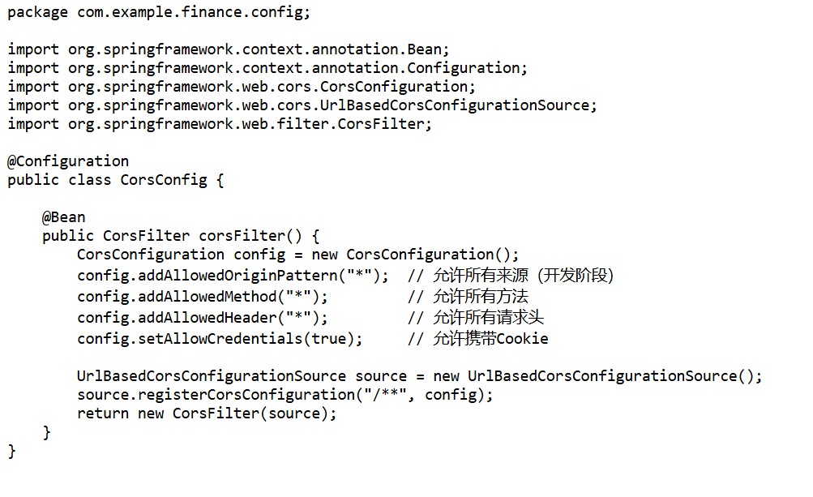

密码加密配置（PasswordEncoderConfig.java）

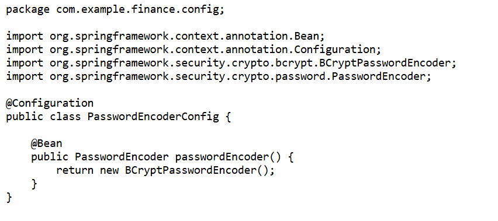

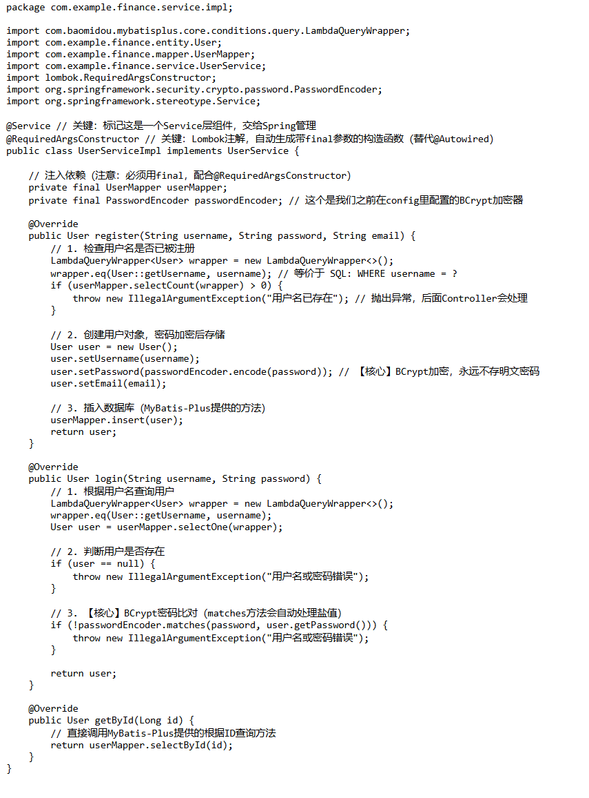用户登录核心代码（UserServiceImpl.java）

统一返回结果封装（Result.java）

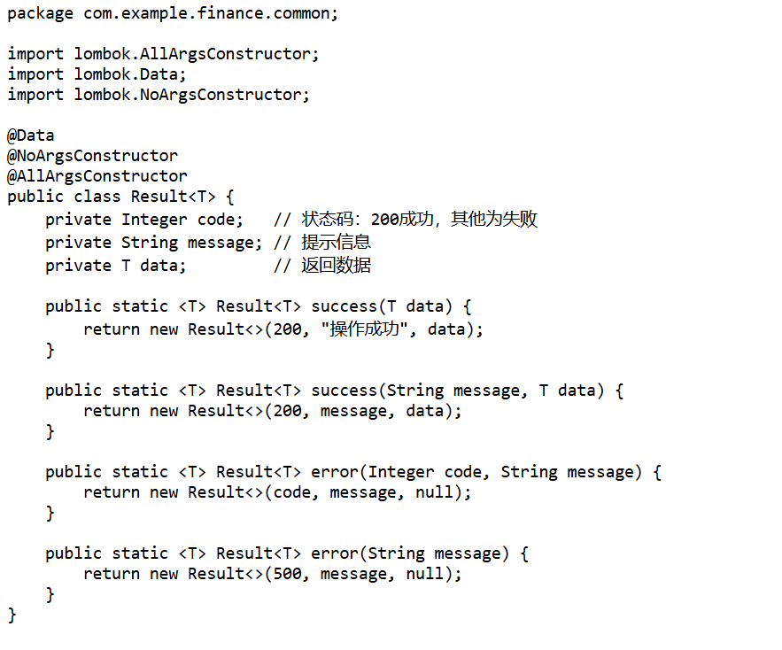

全局异常处理（GlobalExceptionHandler.java）

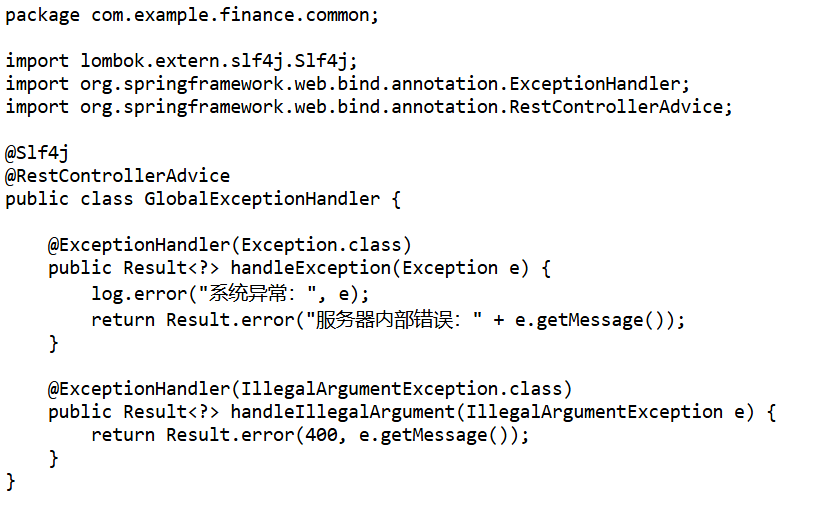

登录功能核心代码（login.js）

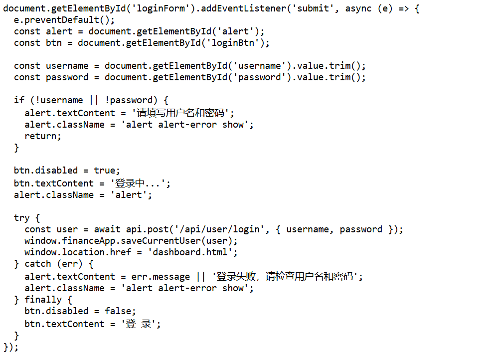

前端整体成果：完成登录注册、数据仪表盘、收支记账、预算管理、数据统计等全部核心页面开发，前端交互逻辑与后端接口全部对接完成；完成系统界面统一配色、卡片式布局搭建与移动端响应式适配，优化表单实时校验、操作弹窗提示、数据图表动态刷新等使用体验，已将所有原型页面替换为系统真实运行截图；前端所用核心技术均顺利落地，完整业务代码可直接运行，无核心功能缺失，满足日常个人财务记账、预算管控、数据分析全流程使用需求。

后端具体实现：完成用户注册登录，支持用户名唯一性校验、密码加密及登录身份验证，可根据用户 ID 查询信息并屏蔽密码字段；实现收支记录增删改查，自带金额校验，支持分页查询与按月、分类条件筛选；具备预算设置、进度计算、超支提醒及删除管理能力；支持月度收支汇总、支出分类统计、多周期收支趋势分析，聚合各类数据满足前端仪表盘展示需求；搭建统一异常处理机制，规范错误返回格式，配置全局跨域适配前后端分离开发，所有接口依托用户 ID 实现数据隔离，严格保障用户财务数据安全。

\> 中期要求：

\> - 可先填写已确定的关键技术；

\> - 可展示已完成页面或原型图；

\> - 核心代码片段可暂不完整。

\>

\> 结项要求：

\> - 补全最终关键技术说明；

\> - 使用真实系统界面截图替换原型图；

\> - 展示关键功能的代码片段。

\---

五、系统测试 【中期先写方案；结项补全结果】

1\. 测试方案

功能测试：黑盒测试，按照需求逐项验证接口与页面功能是否正常。

接口测试：使用接口测试工具对后端 RESTful API 进行请求与返回验证。

边界测试：测试空数据、重复数据、异常格式、越权访问等场景。

兼容性测试：在 Chrome、Edge 等主流浏览器验证页面显示与交互。

数据隔离测试：验证不同用户只能查看 / 操作自己的数据。

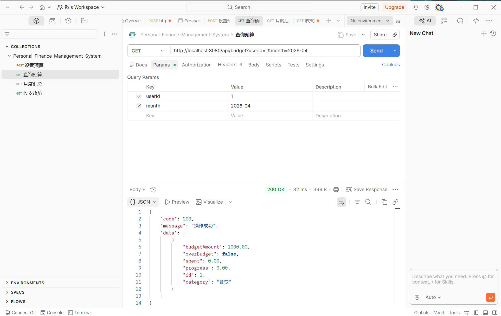

测试范围

用户模块：注册、登录、信息查询

记账模块：增、删、改、查、分页、筛选

预算模块：设置、查询进度、删除、超支判断

统计模块：月度汇总、分类占比、趋势图表

仪表盘：数据聚合展示

全局：异常处理、跨域、密码加密、数据隔离

2\. 测试结果

用户注册 用户名非空校验、密码长度≥6 位校验、重复用户名拦截✅ 通过

用户登录 正确账号密码登录成功、错误密码提示 “密码错误”、非注册账号登录拦截✅ 通过

添加收入 / 支出 金额＞0 校验、分类非空校验、数据保存后接口返回成功且前端展示正常✅ 通过

修改记录 修改记录的金额 / 分类 / 日期后，后端数据更新、前端列表同步刷新✅ 通过

删除记录 删除指定记录后，后端数据删除、前端列表不再显示该记录✅ 通过

筛选记录 按月 / 分类筛选记账记录，查询结果与筛选条件匹配、无数据遗漏 / 错误 ✅ 通过

设置预算 同一用户 + 同一分类 + 同一月份重复设置预算时，系统自动更新而非重复创建 ✅ 通过

预算进度 消费金额自动统计，预算进度条按 “已消费 / 总预算” 比例计算，显示精度准确✅ 通过

超支判断当某分类支出金额＞预算金额时，系统返回超支标记，前端正确展示✅ 通过

月度统计月度收入、支出、结余（收入 - 支出）计算结果与实际记录一致✅ 通过

统计图表 饼图（分类占比）、折线图（收支趋势）数据与后端接口返回数据完全一致 ✅ 通过

分页查询 页码切换、页大小调整后，列表展示数据条数、内容符合分页规✅ 通过

跨域访问 前端页面可正常调用不同域名下的后端 API，无跨域报错，数据交互正常✅ 通过

密码加密 数据库中用户密码存储为密文（不可逆加密），无明文存储情况✅ 通过

数据隔离 用户 A 无法查询 / 修改用户 B 的记账记录、预算数据、统计信息，权限拦截有效✅ 通过

3\. 问题与改进

发现问题

前端直接打开 HTML 会出现跨域提示

未登录时仍可通过 URL 进入页面

部分异常提示不够友好

无接口限流与重复提交防护

统计图表在无数据时显示空白

改进措施

前端使用 Live Server 运行，避免本地文件协议跨域

增加登录拦截，未登录自动跳回登录页

完善全局异常提示，统一错误文案

增加简单 Token 机制，提升安全性

图表无数据时显示 “暂无数据”，提升体验

\> 中期要求：

\> - 先写测试计划、测试范围、测试思路；

\> - 可列出准备执行的测试用例。

\>

\> 结项要求：

\> - 补全真实测试结果；

\> - 记录主要问题及修正情况。

\---

六、用户手册 【结项补全】

**1 安装部署说明**

本系统为个人理财管理系统，采用前后端分离架构，后端基于 Spring Boot 3.2.5 开发，前端为纯静态 HTML/JS/CSS 资源，以下为详细环境配置与部署步骤。

环境配置要求

硬件环境 服务器端：CPU 双核及以上，内存 4GB 及以上，硬盘可用空间 ≥ 20GB，网络带宽 ≥ 10Mbps客户端：任意支持现代浏览器的设备，内存 ≥ 2GB，推荐 Chrome 80+、Edge 80+、Firefox 75+ 浏览器

部署步骤

步骤 1：数据库初始化

1\. 启动 MySQL 服务，确保服务正常运行，端口默认 3306 可访问

2\. 创建系统专用数据库，执行以下 SQL 命令：

CREATE DATABASE personal_finance

DEFAULT CHARACTER SET utf8mb4

COLLATE utf8mb4_unicode_ci;

3\. 创建数据库用户并授权：

CREATE USER 'finance_user'@'%' IDENTIFIED BY '你的数据库密码';

GRANT ALL PRIVILEGES ON personal_finance.\* TO 'finance_user'@'%';

FLUSH PRIVILEGES;

4\. 导入系统初始化 SQL 脚本，完成表结构与初始数据的创建：

mysql -u finance_user -p personal_finance \< init_db.sql

步骤 2：后端服务部署

1\. 拉取 / 上传后端源码，进入项目根目录

2\. 使用 Maven 打包项目，生成可执行 Jar 包：

mvn clean package -DskipTests

打包完成后，可在 target/ 目录下找到 finance-1.0.0.jar 文件

3\. 修改后端配置文件 application.yml，配置数据库连接信息：

server:

port: 8080 \# 后端服务端口，默认无需修改

spring:

datasource:

url: jdbc:mysql://localhost:3306/personal_finance?useUnicode=true&characterEncoding=utf-8&serverTimezone=Asia/Shanghai&useSSL=false

username: root \# 替换为你的数据库用户名

password: 123456 \# 替换为你的数据库密码

4\. 启动后端服务，推荐使用后台运行模式：

nohup java -jar finance-1.0.0.jar \> finance.log 2\>&1 &

5\. 验证服务：执行 curl http://localhost:8080/api/dashboard/summary，若返回正常 JSON 数据则后端启动成功。

步骤 3：前端资源部署

1\. 上传前端静态资源（所有 .html、.js、.css 文件）到服务器目录，例如 /opt/finance-frontend/

2\. 配置 Nginx 反向代理，实现前后端接口转发，修改 Nginx 配置文件：

server {

listen 80;

server_name 你的服务器IP或域名;

\# 前端静态资源映射

location / {

root /opt/finance-frontend;

index index.html;

try_files \$uri \$uri/ /index.html;

}

\# 后端API接口反向代理

location /api/ {

proxy_pass http://127.0.0.1:8080/api/;

proxy_set_header Host \$host;

proxy_set_header X-Real-IP \$remote_addr;

proxy_set_header X-Forwarded-For \$proxy_add_x_forwarded_for; }}

3\. 重启 Nginx 使配置生效：

nginx -s reload

步骤 4：部署验证

1\. 打开浏览器，访问 http://你的服务器IP，若能正常打开系统登录页，则部署完成

2\. 测试功能：使用初始账号登录，尝试新增一条收支记录，验证数据读写是否正常

1.3 常见问题解决

1\. 后端启动报错：UnsupportedClassVersionError

\- 原因：Java 版本低于 17，Spring Boot 3.x 不支持低版本 Java

\- 解决：安装 JDK 17 并配置为默认 Java 环境

2\. 前端页面能打开，但无法加载数据

\- 原因：Nginx 反向代理配置错误，或后端服务未启动

\- 解决：检查后端服务是否正常运行，核对 Nginx 配置中的代理地址是否正确

3\. 数据库连接失败

\- 原因：数据库地址 / 用户名 / 密码错误，或数据库未启动，或防火墙未开放 3306 端口

\- 解决：核对 application.yml 中的数据库配置，测试数据库连接，开放防火墙端口

4\. 登录后页面空白

\- 原因：浏览器缓存了旧版本静态资源

\- 解决：强制刷新浏览器（Ctrl+F5），清除浏览器缓存后重试

**2. 操作指南**

本系统为个人理财管理工具，支持收支记录、预算管控、统计分析等功能，以下为核心功能的使用说明。

系统登录与注册

用户注册

1\. 打开系统访问地址，进入登录页面，点击「没有账号？去注册」

2\. 在注册页面，填写用户名、密码、确认密码

3\. 点击「注册」按钮，完成账号创建，系统自动跳转至登录页

系统登录

1\. 在登录页面，输入你的账号和密码

2\. 点击「登录」按钮，验证通过后自动进入系统仪表盘页面

3\. 若忘记密码，可点击登录页「忘记密码」，通过绑定信息重置密码

退出登录

点击页面右上角的「退出」按钮，系统将清除登录状态，跳转回登录页面。

仪表盘概览

登录系统后默认进入仪表盘页面，这里展示你当月的财务概览信息：

1\. 核心数据卡片：展示当月总收入、总支出、结余金额，快速了解月度财务状况

2\. 支出分类饼图：可视化展示当月不同分类的支出占比，直观查看消费结构

3\. 预算进度：展示当前月度预算的使用进度，包含总预算、已用金额、剩余金额，进度条会根据使用比例自动变色（超过 90% 显示红色预警）

4\. 近期账单：展示最近 5 条收支记录，快速查看近期消费明细

你可以通过页面顶部的月份选择器，切换查看不同月份的概览数据。

记账管理

记账是系统的核心功能，用于记录你的每一笔收支：

1\. 点击左侧菜单栏「记账管理」，进入记账页面

2\. 新增收支记录：

\- 选择记录类型：支出 / 收入 - 选择消费 / 收入分类：支出支持餐饮、交通、购物等分类，收入支持工资、奖金、投资等分类- 填写金额、记录日期，可选择填写备注信息- 点击「提交」按钮，完成记录新增

3\. 记录列表：页面下方会展示所有的收支记录，包含类型、分类、金额、日期、备注信息

4\. 删除记录：若记录有误，可点击对应记录操作列的「删除」按钮，确认后即可删除该记录

预算管理

预算管理帮助你管控月度消费，避免超支：

1\. 点击左侧菜单栏「预算管理」，进入预算页面

2\. 设置月度总预算：

\- 在「月度预算设置」区域，输入你当月的总预算金额

\- 点击「保存」按钮，完成总预算设置

3\. 分类预算设置：你可以为不同的消费分类设置单独的预算，比如餐饮预算 1000 元、交通预算 500 元

4\. 预算进度查看：

\- 页面会展示总预算的使用进度，包含已用金额、剩余金额、进度条

\- 同时展示每个分类预算的使用进度，帮助你针对性管控不同类别的消费

分类管理

分类管理用于自定义你的收支分类，适配个性化的记账需求：

1\. 点击左侧菜单栏「分类管理」，进入分类页面

2\. 页面分为支出分类和收入分类两个区域

3\. 你可以新增、编辑、删除自定义分类，系统默认提供常用分类，你可以根据自己的消费习惯调整

统计分析

统计分析功能帮你深度分析财务状况，发现消费规律：

1\. 点击左侧菜单栏「统计分析」，进入统计页面

2\. 时间范围选择：你可以选择查看近 3 个月、近 6 个月或近 12 个月的统计数据

3\. 核心统计内容：

\- 月度收支汇总卡片：展示所选周期内的总收入、总支出、平均月度结余

\- 支出分类饼图：展示整个周期内的支出分类占比

\- 分类排行榜：展示消费最高的 Top6 分类，帮助你找到最大的消费项

\- 收支趋势折线图：展示每个月的收入与支出变化趋势，直观查看财务变化情况账户设置

1\. 点击左侧菜单栏「账户设置」，进入个人信息页面

2\. 个人信息修改：你可以修改你的用户名、头像等个人信息

3\. 密码修改：在修改密码区域，输入原密码和新密码，完成密码更新

4\. 账号安全：查看你的账号 ID、注册时间等安全信息

操作注意事项

1\. 首次使用请先完成预算设置，方便系统帮你管控月度消费

2\. 建议及时记录收支记录，避免遗漏导致财务数据不准确

3\. 系统会自动备份你的数据，但仍建议定期导出数据备份，防止数据丢失

4\. 若操作过程中遇到页面卡顿，可刷新页面重试，若问题持续请联系系统管理员\> 中期阶段可暂不写完整。

\> 结项阶段需根据最终系统补全。

\---

七、项目总结 【中期可先写阶段总结；结项补全】

\#1. 成果总结

本项目为轻量级个人理财管理系统，采用前后端分离架构，基于 Spring Boot + MySQL + HTML/CSS/JS + ECharts 实现。

截至中期阶段，已完成以下成果：

完成需求分析、系统架构设计、数据库设计，结构规范合理；

实现后端部分接口：用户注册登录、收支记录、预算管理、统计分析、仪表盘聚合接口；

实现前端部分页面：登录、注册、仪表盘、记账管理、预算、统计图表；

实现核心安全机制：密码 BCrypt 加密、数据隔离、全局异常处理、跨域支持；

2\. 不足与改进方向

前端页面为本地文件打开模式，部分浏览器存在跨域提示； 未加入正式 Token 登录验证，仅通过前端简单判断登录状态； 缺少批量操作、数据导出等扩展功能； 缺少完整单元测试，仅做功能验证； 日志输出与系统监控较为简单。增加数据导出、账单分类自定义、预算提醒推送功能； 补充单元测试与接口自动化测试； 增加操作日志、访问日志，便于问题追踪； 支持容器化部署，简化环境配置。

\# 3. 成员分工表

（

| **姓名** | **班级** | **学号**    | **Git 账号** | **承担任务**                                                        |
|----------|----------|-------------|--------------|---------------------------------------------------------------------|
| 杨鑫     | 计科一班 | 20240557033 | xtu-yx       | 项目负责人、需求文档撰写、系统测试、文档整合、Git 管理              |
| 辛世豪   | 计科三班 | 20240557233 | bubuperper   | 前端页面开发、界面实现、接口联调                                    |
| 范国增   | 计科三班 | 20240557234 | fgz-iphone   | 前端页面开发、样式美化、页面交互实现                                |
| 朱君昊   | 计科三班 | 20240557231 | xtu-ZhuJH    | 后端开发、Controller/Service 层实现、接口开发，数据库设计、SQL 编写 |
| 饶轩     | 计科一班 | 20240557013 | 散           | 后端开发、Mapper/Entity 层、数据库设计、SQL 编写                    |

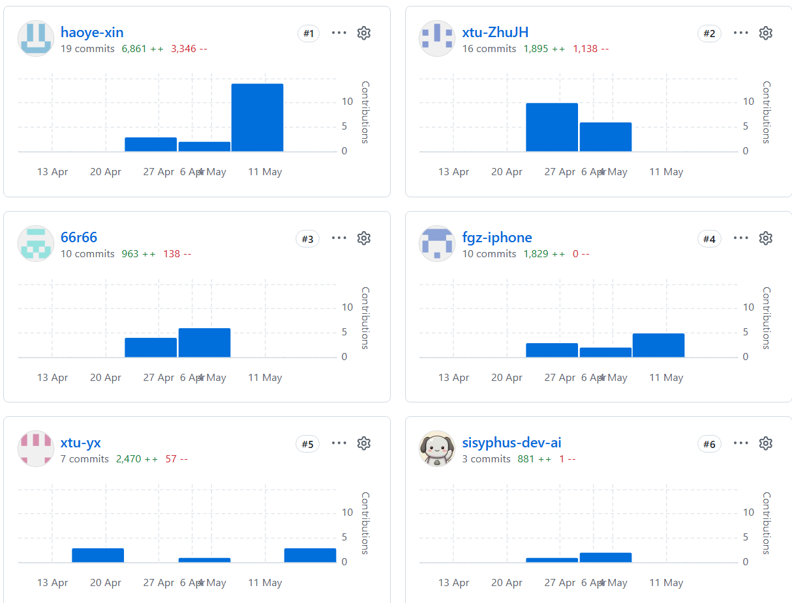4. Git 提交记录

\>

\> 结项要求：

\> - 更新为最终完成情况；

\> - 补全最终成员分工与Git记录说明。

\---

\#\# 附录

\- 参考资料

\- 源代码仓库链接

\- 其他补充材料

\---

\#\# 附：推荐的图片与文件组织方式

\`\`\`text

docs/

report/

中期与结项报告.md

assets/

fig_architecture.png

fig_er.png

fig_ui_login.png

fig_ui_admin.png

fig_test_result.png

\`\`\`

图片在正文中建议这样引用：

\`\`\`md

\`\`\`

\---

\#\# 附：版本推进建议

\- \*\*中期版\*\*：至少完成 第一～三章，并对第四、五、七章写出当前进展。

\- \*\*结项版\*\*：在中期版基础上补全第四～七章，整理后导出为最终软件说明书。

\- \*\*不要中期另写一套、结项再重写一套。\*\*
