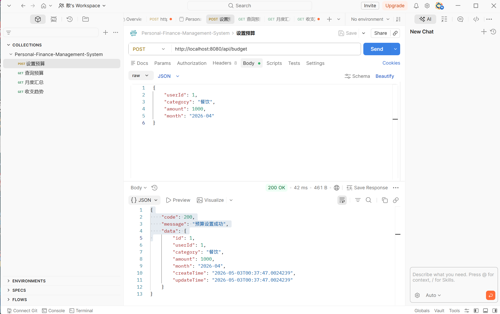
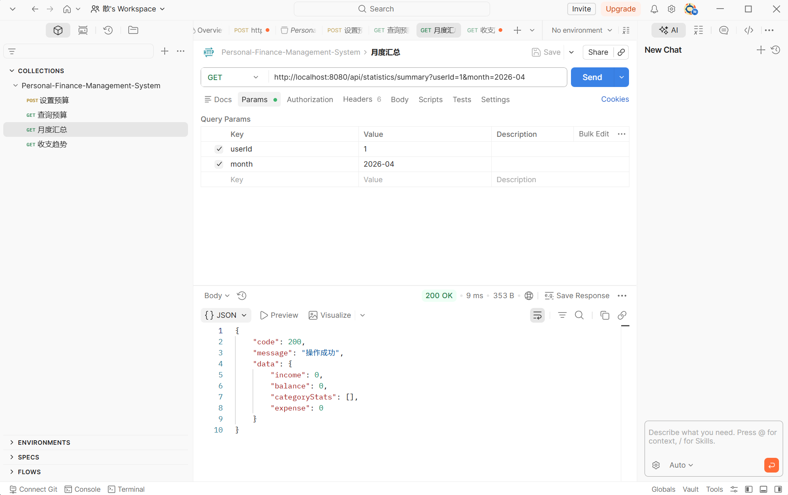
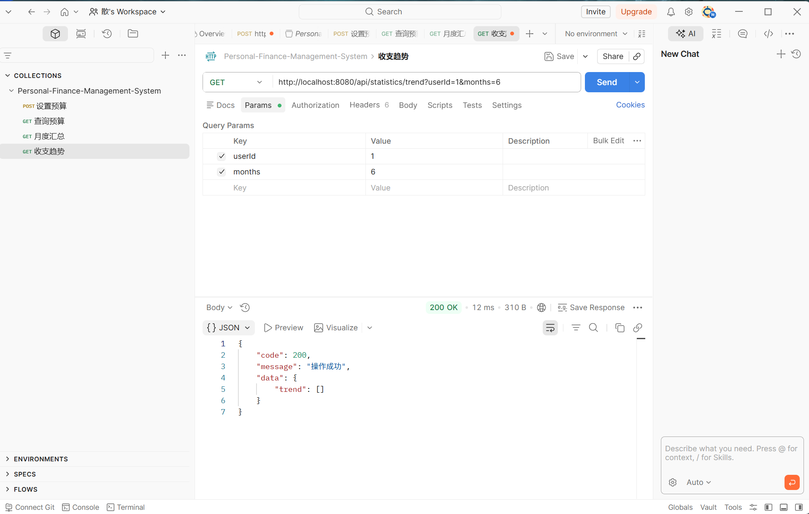

# API 测试记录

> 测试时间：2026-05-03  
> 测试工具：Postman / 浏览器  
> 后端地址：http://localhost:8080  
> 测试人：成员B

---

## 一、后端接口测试（Postman）

### 1. 设置预算 (POST /api/budget)

- 方法：POST
- URL：http://localhost:8080/api/budget
- Body：
```json
{
    "userId": 1,
    "category": "餐饮",
    "amount": 1000,
    "month": "2026-04"
}
```

- 状态码：200
- 响应体：
```json
{
    "code": 200,
    "message": "预算设置成功",
    "data": {
        "id": 1,
        "userId": 1,
        "category": "餐饮",
        "amount": 1000.00,
        "month": "2026-04"
    }
}
```
✅ 测试通过



---

### 2. 查询预算 (GET /api/budget)

- 方法：GET
- URL：http://localhost:8080/api/budget?userId=1&month=2026-04

- 状态码：200
- 响应体：
```json
{
    "code": 200,
    "data": [
        {
            "id": 1,
            "category": "餐饮",
            "budgetAmount": 1000.00,
            "spent": 0.00,
            "progress": 0.00,
            "overBudget": false
        }
    ]
}
```
✅ 测试通过


---

### 3. 月度汇总 (GET /api/statistics/summary)

- 方法：GET
- URL：http://localhost:8080/api/statistics/summary?userId=1&month=2026-04

- 状态码：200
- 响应体：
```json
{
    "code": 200,
    "data": {
        "income": 0,
        "expense": 0,
        "balance": 0,
        "categoryStats": []
    }
}
```
✅ 测试通过



---

### 4. 收支趋势 (GET /api/statistics/trend)

- 方法：GET
- URL：http://localhost:8080/api/statistics/trend?userId=1&months=6

- 状态码：200
- 响应体：
```json
{
    "code": 200,
    "data": {
        "trend": []
    }
}
```
✅ 测试通过



---

## 二、前后端联调测试（浏览器）

| 序号 | 功能模块 | 操作 | 预期结果 | 实际结果 | 状态 |
|------|----------|------|----------|----------|------|
| 1 | 用户注册 | 输入用户名、密码、邮箱，点击注册 | 提示注册成功 | 注册成功 | ✅ |
| 2 | 用户登录 | 用注册账号登录 | 登录成功，跳转首页 | 登录成功 | ✅ |
| 3 | 添加收入 | 添加收入：工资 5000 元 | 记录添加成功 | 添加成功 | ✅ |
| 4 | 添加支出 | 添加支出：餐饮 50 元 | 记录添加成功 | 添加成功 | ✅ |
| 5 | 记录列表 | 查看记账列表 | 显示正常，分页正常 | 显示正常 | ✅ |
| 6 | 删除记录 | 删除某条记录 | 删除成功，列表刷新 | 删除成功 | ✅ |
| 7 | 仪表盘 | 打开 dashboard.html | 显示汇总、账单、预算 | 显示正常 | ✅ |
| 8 | 统计图表 | 打开 statistics.html | 图表正常渲染 | 图表正常 | ✅ |
| 9 | 预算设置 | 设置餐饮预算 1000 元 | 设置成功 | 设置成功 | ✅ |
| 10 | 预算进度 | 查看预算页进度 | 显示已消费 50 元，进度 5% | 进度正确 | ✅ |

✅ 联调测试全部通过。
